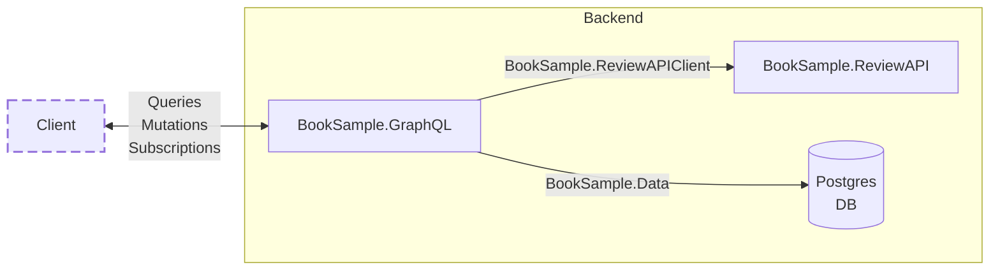

# GraphQL Books Sample - [Hot Chocolate](https://github.com/chilliCream/graphql-platform/)

Sebastian Szvetecz - CN innovation - sebastian.szvetecz@cninnovation.com

This repository contains a sample project that demonstrates how to use Hot Chocolate to create a GraphQL API in ASP.NET Core.

The /src directory contains the source code for the project.

- **BookSample.GraphQL** (BookSample.GraphQL.sln)
  - **BookSample.GraphQL**\
    This project contains the GraphQL API. It uses Hot Chocolate to create a GraphQL schema and resolvers.
  - **BookSample.Data**\
    This project contains the data access layer. It uses Entity Framework Core to interact with the database.\
    It is used by the GraphQL API to fetch data from the database.
  - **BookSample.ReviewApiClient**\
    This project contains a client for the ReviewAPI. It uses HttpClient to make HTTP requests to the ReviewAPI. [Kiota](https://learn.microsoft.com/en-us/openapi/kiota/overview) is used to generate the client code.\
    It is used by the GraphQL API to fetch reviews and ratings for books.
- **BookSample.ReviewAPI** (BookSample.ReviewAPI.sln)\
  This project contains an small API that provides reviews and ratings for books.

The following diagram shows a schematic overview of the architecture:

- **BookSample.Aspire** (BookSample.Aspire.sln)
  In this sample application [Aspire](https://learn.microsoft.com/en-us/dotnet/aspire/get-started/aspire-overview) is used to improve, among others, the development experience.

  In _BookSample.Aspire.AppHost_ the following components are configured:
  - **Database**
    A PostgreSQL database is used to store the data. In Development mode, Aspire will use a Docker container to run the database.
    So an installation of PostgreSQL is not required.
  - **Database-Seeder**
    The database seeder is used to seed the database with sample data.
  - **Reviews-API**
    The Review API as described above.
  - **GraphQL-API**
    The GraphQL API as described above.

## Getting Started

For running the application including all components, the following steps are required:
- Install [Docker Desktop](https://www.docker.com/products/docker-desktop/)
- Run the following commands in the command-line:
  - `cd [>>>>RootPathOfTheRepository<<<<]\src\BookSample.Aspire\BookSample.Aspire.AppHost`
  - `dotnet run`
- After starting the Aspire AppHost, the following services are available:
  - **Aspire Dashboard**: [https://localhost:17054](https://localhost:17054)
  - **GraphQL API and GraphQL Playground**: [https://localhost:7089/graphql](https://localhost:7089/graphql)
  - **Reviews API**: [https://localhost:7079/reviews](https://localhost:7079/reviews)
- Open [https://localhost:7089/graphql](https://localhost:7089/graphql) in your browser to test the first GraphQL queries, mutations, and subscriptions in the GraphQL Playground.