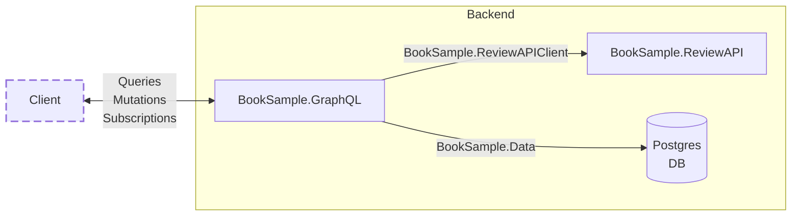

# GraphQL Books Sample - [Hot Chocolate](https://github.com/chilliCream/graphql-platform/)

Sebastian Szvetecz - CN innovation - sebastian.szvetecz@cninnovation.com

This repository contains a sample project that demonstrates how to use Hot Chocolate to create a GraphQL API in ASP.NET Core.

The /src directory contains the source code for the project.

- **BookSample.GraphQL** (BookSample.GraphQL.sln)
  - **BookSample.GraphQL**\
    This project contains the GraphQL API. It uses Hot Chocolate to create a GraphQL schema and resolvers.
  - **BookSample.Data**\
    This project contains the data access layer. It uses Entity Framework Core to interact with the database.\
    It is used by the GraphQL API to fetch data from the database.
  - **BookSample.ReviewAPIClient**\
    This project contains a client for the ReviewAPI. It uses HttpClient to make HTTP requests to the ReviewAPI. [Kiota](https://learn.microsoft.com/en-us/openapi/kiota/overview) is used to generate the client code.\
    It is used by the GraphQL API to fetch reviews and ratings for books.
- **BookSample.ReviewAPI** (BookSample.ReviewAPI.sln)\
  This project contains an small API that provides reviews and ratings for books.

The following diagram shows a schematic overview of the architecture:

